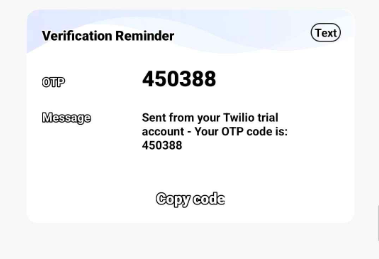
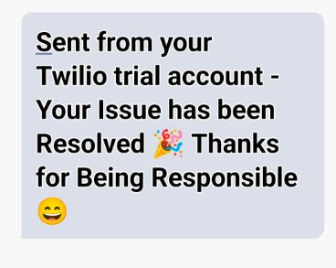

<div align="center">
  
</div>

<hr>

<div align="center">
  &nbsp;
  &nbsp;
  
</div>
<br>

<div align="center">
  <table align="center">
    <thead align="center">
      <tr border: 1px;>
        <td><strong>🌟 Stars</strong></td>
        <td><strong>🍴 Forks</strong></td>
        <td><strong>🐛 Issues</strong></td>
        <td><strong>🔔 Pull Requests</strong></td>
      </tr>
    </thead>
    <tbody>
      <tr>
        <td><a href="https://github.com/sailaja-adapa/Shresta/stargazers" target="_blank"></a></td>
        <td><a href="https://github.com/sailaja-adapa/Shresta/forks" target="_blank"></a></td>
        <td></td>
        <td></td>
      </tr>
    </tbody>
  </table>
</div>

<hr>

## Problem Statement 😖

Urban areas face critical challenges like waste management inefficiency, traffic issues, and unsafe public spaces. At the same time, citizens often struggle to report such problems effectively. This leads to delayed resolutions, further deteriorating the environment and public well-being.

**Shresta-City Insight** aims to solve this by providing a platform for citizens to report civic issues like garbage on roads, traffic hazards, etc., ensuring timely action and reducing environmental impact.

---

## Proposed Solution 🤩

**Shresta-City Insight** allows users to report issues, track resolutions, upload evidence (such as photos), and receive notifications about the progress of their complaints. It leverages **Firebase** for backend services, and **Twilio** for real-time SMS notifications, keeping users informed about their reports.

---

## Glimpse ✨
Check out the live demo of the platform [Shresta City Insight](https://shresta.vercel.app/)

---

### How to Set Up

To get started with **Shresta-City Insight** 🚀, make sure you have **Node.js** and **npm** installed on your machine 💻.

1) To check this, you can type **node -v** and **npm -v** in the terminal.
2) **Fork** the repo 🍴 by clicking the fork button on GitHub and give it a name.
3) **Clone** it to your local machine using:

    ```sh
    git clone https://github.com/yourusername/projectname.git
    ```

4) **Navigate** to the project directory:

    ```sh
    cd projectname  # Example: cd Shresta-city-insight
    ```

5) **Install** the dependencies 🔧:

    ```sh
    npm install  
    ```

6) Start the local server 🌍:

    ```sh
    npm start
    ```

    This will launch the development server at:
    👉 **http://localhost:3000/** 🖥️

## Tech Stack Used

<div align="center">
  
  
  
  
  
  
  
  
</div>

---

## Features

- **Civic Issue Reporting**: Report issues with real-time tracking.
- **Secure User Authentication** and Authorization.
- **OTP Authentication** using Firebase for secure user verification.
- **Real-time Notifications** via SMS using Twilio.
- **Scalable Infrastructure** with Firebase services.

## Workflow

  + **Citizen Workflow 👩‍🦰:**
    - The user is required to register using their Google email ID (@gmail.com) for authentication and must provide the required details.📩
    - The user logs in using registered email Id and password.🔐
    - The user provides their location manually or allows it to be retrieved via an API. 📍
    - An OTP is sent to their registered mobile number for verification, which must be entered to proceed. 🔢
      <br>  
      
      <br>  
    
    - Upon successful verification, the user is redirected to the Complaint Submission Portal where they can report civic issues by uploading relevant images or documents. 📸📁
    - Alternatively, users can utilize voice input to lodge a complaint, which is transcribed into text via a Speech-to-Text API. 🎙️🗣️
    - After submitting the complaint, the user is navigated to the Thank you Page, where they have the option to provide feedback on their experience. ✍️
    
  + **Officer Registration & Complaint Management Process 👮‍♂️📋**
    

    - Officers are required to register using an official email ID with the "@svecw.edu.in" domain, as this domain is exclusively designated for authorized personnel. ✉️✅
    - Upon successful login, officers gain access to the Complaint Management Dashboard, where they can review all submitted complaints along with their corresponding images. 🖥️📸
    - When an officer marks a complaint as resolved and selects the delete option, an automated notification is sent to the complainant via Twilio, informing them of the resolution. 📩🔔
      <br>  
       
      <br>  
    


## Our Goals 🎯

The project aims to tackle social issues like waste management, civic improvements, and community-driven change.

---

## Contributing

Pull requests are welcome. For major changes, please open an issue first to discuss what you would like to change.

## License

[MIT](https://choosealicense.com/licenses/mit/)

<h3 align="center"> Show some ❤️ by starring this awesome repository! </h3>
