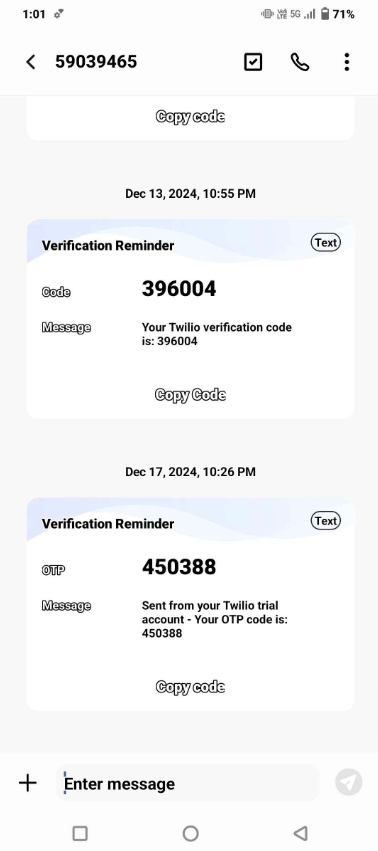
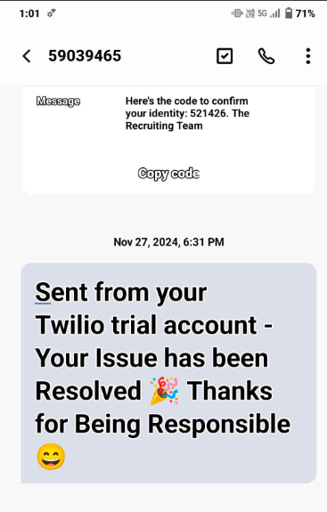

  

  &nbsp;
  &nbsp;
  

 

  <table align="center">
    <thead align="center">
      <tr border: 1px;>
        <td><strong>🌟 Stars</strong></td>
        <td><strong>🍴 Forks</strong></td>
        <td><strong>🐛 Issues</strong></td>
        <td><strong>🔔 Open PRs</strong></td>
        <td><strong>🔕 Closed PRs</strong></td>
      </tr>
    </thead>
    <tbody>
      <tr>
        <td></td>
        <td></td>
        <td></td>
        <td></td>
        <td></td>
      </tr>
    </tbody>
  </table>

## Problem Statement 😖

Urban areas face critical challenges like waste management inefficiency, traffic issues, and unsafe public spaces. At the same time, citizens often struggle to report such problems effectively. This leads to delayed resolutions, further deteriorating the environment and public well-being.

**Shresta-City Insight** aims to solve this by providing a platform for citizens to report civic issues like garbage on roads, traffic hazards, etc., ensuring timely action and reducing environmental impact.

---

## Proposed Solution 🤩

**Shresta-City Insight** allows users to report issues, track resolutions, upload evidence (such as photos), and receive notifications about the progress of their complaints. It leverages **Firebase** for backend services, and **Twilio** for real-time SMS notifications, keeping users informed about their reports.

---

## Glimpse ✨
Check out the live demo of the platform [Shresta City Insight](https://shresta.vercel.app/)

---

### How to Set Up

To get started with **Shresta-City Insight** 🚀, make sure you have **Node.js** and **npm** installed on your machine 💻.
1) To check this , you can type **node -v** and **npm -v** in terminal .

2) Then, **fork** the repo🍴 by clicking at the fork button on github and give it a name
3) **clone** it to your local machine using:

    > git clone https://github.com/yourusername/projectname.git

      projectname is the name given in step 2.
  

4) Next, **navigate** to the project directory by typing these in the terminal of VS Code📂:

    >cd ~ 

    >**cd projectname**

    >ex: cd Shresta-city-insight

5) **Install** the dependencies 🔧:

    >**npm install**  

6) Finally, start the local server to run the project locally 🌍:

    >**npm start**

    This will launch the development server at:
    👉 **http://localhost:3000/** 🖥️

## Tech Stack Used

  
  
  
  
  
  
  
  

---

## Features

- **Civic Issue Reporting**: Report issues with real-time tracking.
- **Secure User Authentication** and Authorization.
- **OTP Authentication** using Firebase for secure user verification.
- **Real-time Notifications** via SMS using Twilio.
- **Scalable Infrastructure** with Firebase services.

## Workflow

  + **Citizen Workflow 👩‍🦰:**
    - User registers using their email Id and fills in a few details.
    - User recieves OTP on their mobile number for verification.
       
      
         
    - Login using given email Id and password.
    - Lands on complaint page. User can upload any civic complaints along with a picture/file upload.
    
  + **Officer Workflow 👮‍♂️:**
    - Officer can see the dashboard of all complaints along with their respective images.
    - Once the officer clicks resolve , user will be sent a message on their phone number saying 
      "Your issue has been resolved".
         
       
       
    - User will be taken to User Satisfaction page for rating.

## Our Goals 🎯

The project aims to tackle social issues like waste management, civic improvements, and community-driven change.

---

## Contributing

Pull requests are welcome. For major changes, please open an issue first to discuss what you would like to change.

## License

[MIT](https://choosealicense.com/licenses/mit/)

<h3 align="center"> Show some ❤️ by starring this awesome repository! </h3>
